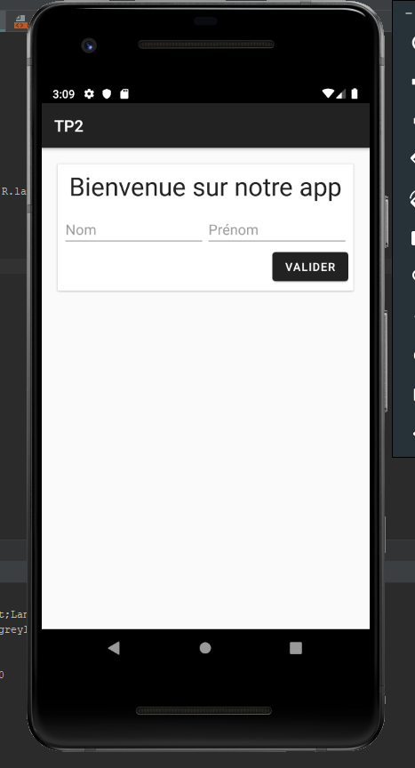
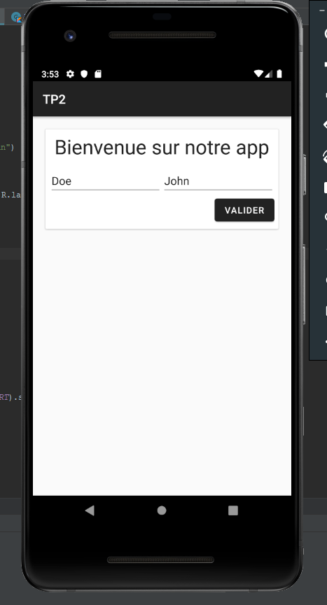
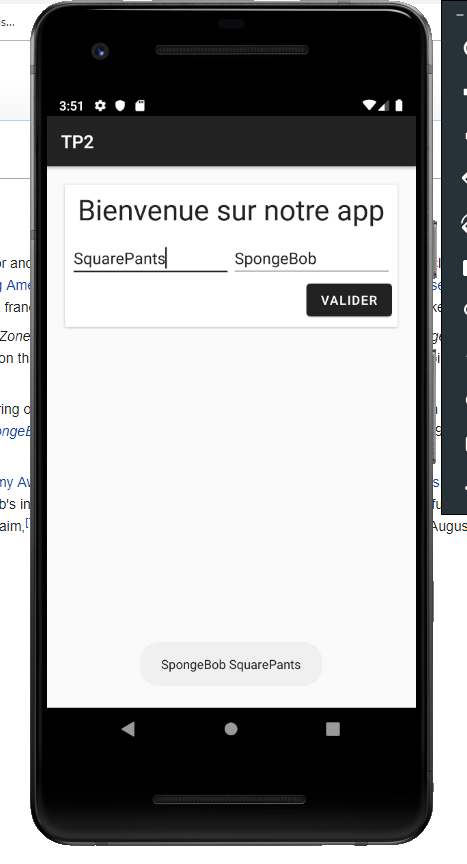
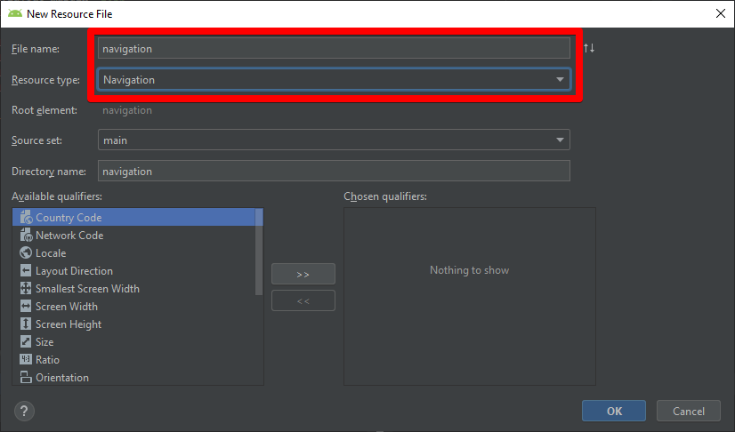
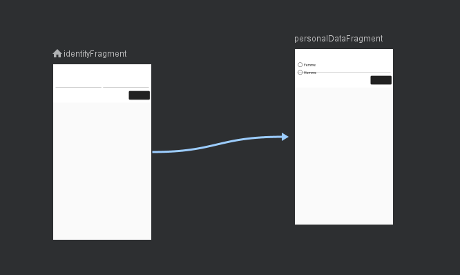
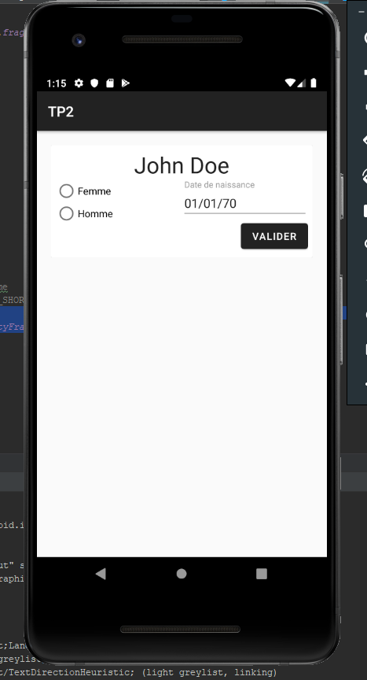

Version PDF : https://drive.google.com/file/d/1hHYwjyqlhF-ikJzPVNepIjD8KGR1ZT6m/view?usp=sharing


# TP2 Communication et ergonomie

Dans le TP précédent, nous avons appris les bases de la programmation Android avec Kotlin en créant des interfaces simples. Ici, nous allons aller un peu plus loin en améliorant la structure de notre application.

Pour ce faire créons un nouveau projet. Pensez à définir les dépendances vers ConstraintLayout et MaterialDesign mais aussi Dagger qui va nous servir pour l'injection de dépendance.

L'injection de dépendances est une technique largement qui permet de poser les bases d'une bonne architecture d'application. **Avec cette approche, vous prenez les dépendances d'une classe et vous les fournissez plutôt que de laisser l'instance de classe les obtenir elle-même.**

L'implémentation de l'injection de dépendances vous offre les avantages suivants:
- Réutilisabilité des classes et découplage des dépendances : la réutilisation du code est améliorée en raison de l'inversion du contrôle, et les classes ne contrôlent plus la façon dont leurs dépendances sont créées, mais fonctionnent avec n'importe quelle configuration.
- Facilité le refactoring
- Facilité de test : une classe ne gère pas ses dépendances, donc lorsque vous la testez, vous pouvez passer différentes implémentations pour vérifier vos différents cas d'utilisation.

```gradle
apply plugin: 'kotlin-kapt'

dependencies {
    ...
    implementation 'androidx.constraintlayout:constraintlayout:2.0.2'
    implementation 'com.google.android.material:material:1.2.1'
    implementation 'com.google.dagger:dagger:2.25.3'
    kapt 'com.google.dagger:dagger-compiler:2.25.3'
}
```

Et à changer le thème de l'application dans ```AndroidManifest.xml```

```xml
android:theme="@style/Theme.MaterialComponents.Light.DarkActionBar"
```

## 1 Data Binding

### 1.1 Trouve moi si tu peux !

Découvrons le data binding d'Android. Cette technique va nous permettre de faire disparaitre la méthode ```findViewById()``` au sein de notre classe et d'augmenter les performances de notre application.

Les avantages du data binding sont multiples :

+ séparation améliorée des données de la vue (en effet, aujourd'hui, on peut déclarer les données directement dans le xml comme on la observé avec les textes)
+ pas de problème de typage
+ pas de recherche dans la hiérarchie des vues pour obtenir la vue souhaitée

Premièrement, il faut activer l'option de liaison des données dans le bloc ```android``` du fichier ```build.gradle (Module: app)```

```gradle
dataBinding {
    enabled = true
}
```

Puis modifier notre vue principale ```activity_main.xml``` en ajoutant le bloc ```<layout>```

```xml
<?xml version="1.0" encoding="utf-8"?>
<?xml version="1.0" encoding="utf-8"?>
<layout xmlns:android="http://schemas.android.com/apk/res/android"
        xmlns:tools="http://schemas.android.com/tools"
        xmlns:app="http://schemas.android.com/apk/res-auto">

    <androidx.cardview.widget.CardView
            android:layout_width="match_parent"
            android:layout_height="wrap_content"
            android:layout_margin="20sp"
            tools:context=".MainActivity">

        <androidx.constraintlayout.widget.ConstraintLayout
                android:layout_width="match_parent"
                android:layout_height="wrap_content"
                android:layout_margin="6sp">

            <TextView
                    android:id="@+id/tv_title"
                    android:layout_width="wrap_content"
                    android:layout_height="wrap_content"
                    android:textAppearance="@style/TextAppearance.AppCompat.Body1"
                    android:textSize="32sp"
                    android:layout_marginBottom="16sp"
                    app:layout_constraintTop_toTopOf="parent"
                    app:layout_constraintRight_toRightOf="parent"
                    app:layout_constraintLeft_toLeftOf="parent" />

            <com.google.android.material.textfield.TextInputLayout
                    android:id="@+id/ev_lastname"
                    android:layout_width="0dp"
                    android:layout_height="wrap_content"
                    app:layout_constraintTop_toBottomOf="@id/tv_title"
                    app:layout_constraintLeft_toLeftOf="parent"
                    app:layout_constraintRight_toRightOf="@id/tv_guideline">

                <com.google.android.material.textfield.TextInputEditText
                        android:id="@+id/ti_lastname"
                        android:layout_width="match_parent"
                        android:layout_height="wrap_content"
                        android:inputType="text"/>

            </com.google.android.material.textfield.TextInputLayout>

            <com.google.android.material.textfield.TextInputLayout
                    android:id="@+id/ev_firstname"
                    android:layout_width="0dp"
                    android:layout_height="wrap_content"
                    app:layout_constraintTop_toBottomOf="@id/tv_title"
                    app:layout_constraintRight_toRightOf="parent"
                    app:layout_constraintLeft_toLeftOf="@id/tv_guideline">

                <com.google.android.material.textfield.TextInputEditText
                        android:id="@+id/ti_firstname"
                        android:layout_width="match_parent"
                        android:layout_height="wrap_content"
                        android:inputType="text"/>

            </com.google.android.material.textfield.TextInputLayout>

            <com.google.android.material.button.MaterialButton
                    android:id="@+id/bt_validate"
                    android:layout_width="wrap_content"
                    android:layout_height="wrap_content"
                    app:layout_constraintTop_toBottomOf="@id/ev_firstname"
                    app:layout_constraintRight_toRightOf="parent"/>

            <androidx.constraintlayout.widget.Guideline
                    android:layout_width="wrap_content"
                    android:layout_height="wrap_content"
                    android:id="@+id/tv_guideline"
                    android:orientation="vertical"
                    android:layout_margin="2sp"
                    app:layout_constraintGuide_percent="0.5"/>

        </androidx.constraintlayout.widget.ConstraintLayout>
    </androidx.cardview.widget.CardView>
</layout>
```

Enfin, il nous faut ajouter une liaison au sein de l'activité avec une variable de liaison. Son type est composé du nom de l'activité + Binding. On change ensuite le ```setContentView()``` pour appliquer la liaison avec la vue.

```kotlin
import androidx.appcompat.app.AppCompatActivity
import android.os.Bundle
import androidx.databinding.DataBindingUtil
import com.example.tp2.databinding.ActivityMainBinding

class MainActivity : AppCompatActivity() {

    private lateinit var binding: ActivityMainBinding

    override fun onCreate(savedInstanceState: Bundle?) {
        super.onCreate(savedInstanceState)
        binding = DataBindingUtil.setContentView(this, R.layout.activity_main)

        binding.apply {
            tvTitle.text = getString(R.string.title)
            tiFirstname.hint = getString(R.string.firstname)
            tiLastname.hint = getString(R.string.lastname)
            btValidate.text = getString(R.string.validate)
        }
    }
}
```

L'application des données se fait dans le groupe ```binding.apply```.

Si vous avez des problèmes de rafraichissement de variables, cliquez sur le bouton 

Le résultat est le suivant :



### 1.2 Le Data++ Binding

Là où va nous servir plus souvent le data binding, c'est lorsqu'on l'utilisera avec des données qui proviennent de nos modèles.

On va alors créer un modèle *User* dans un package *model* qui sera contenu dans notre dossier package *com.example.tp2*.

```kotlin
package com.example.tp2.model

data class User(var lastname: String = "", var firstname: String = "")
```

Pour pouvoir lier cet objet avec notre formulaire directement dans le layout, il nous faut déclarer l'objet dans le fichier ;

```xml
<data>
    <variable
      name="user"
      type="com.example.tp2.model.User" />
</data>
```

Ensuite, la magie opère lorsque vous ajoutez la propriété suivante sur vos *TextInput*.

```xml
android:text="@={user.lastname}"

android:text="@={user.firstname}"
```

Comme à chaque fois, il faut penser à initialiser notre objet dans notre code activité. Ici, je décide de l'initialiser les variables.

```kotlin
private val user: User = User("Doe","John")

//...

binding.user = user
```



Au final, l'objet se remplit automatiquement, même si vous changez les valeurs. Un exemple en ajoutant l'affichage d'un toast à la validation.

<div style="page-break-after: always;"></div>

```kotlin
        //...

        binding.btValidate.setOnClickListener {
            validate(it)
        }
    }

    private fun validate(view: View) {
        val message = user?.firstname + " " + user?.lastname
        Toast.makeText(this, message, Toast.LENGTH_SHORT).show()
    }
```



En résumé :
+ Pour remplacer la méthode ```findViewById<Button>(R.id.validate_button)``` pour la liaison des données on :
    1.  Active la liaison de données dans la section Android du fichier build.gradle: ```dataBinding {enabled = true}```
    2. Utilise ```<layout>``` comme racine principale de notre layout
    3. On crée le binding en remplaçant ```setContentView(R.layout.activity_main)``` par  ```DataBindingUtil.setContentView(this, R.layout.activity_main)```
    4. On utilise ```binding.validateButton``` pour interagir avec nos vues
+ Pour lier les données à nos vues
    1. On crée notre classe de données
    2. On ajoute le bloc ```<data>``` et on définit notre ```<variable>``` au sein du layout
    3. On initialise notre objet dans notre activité
    4. On lie l'objet au layout avec ```binding.user = user```
    5. On utilise ```@={user.lastname}``` pour lier les propriétés aux vues.


## 2. Fragmenter ses vues

L'ergonomie est quelque chose d'important dans une application. Android a pour cela créé un type de vue spécifique appelé ```Fragment``` qui représente une partie de l'interface utilisateur. Utile également pour la réutilisation du code, il peut être combiné avec d'autres fragments dans une même activité. <br/>
A l'image d'une activité, un fragment a son propre cycle de vie, il peut donc être ajouté ou supprimé à la volée dans une activité.

Il est donc composé d'une classe Koltin + un layout spécifique.

Imaginons que dans notre première activité, après la validation, nous ne souhaitons pas changer d'activité, c'est à dire qu'on ne souhaite pas naviguer, mais seulement cacher le premier bloc et le remplacer par un second qui possédera d'autres données à remplir (age, téléphone, mail...)

Il nous faut déjà créer un premier fragment qui va contenir notre bloc actuel et faire un peu de refactoring.

Pour créer un fragment ***IdentityFragment*** depuis *File > New > Fragment > Fragment (Blank)*

Tout d'abord, nous devons migrer une partie de notre code vers la nouvelle classe ***IdentityFragment.kt*** et vers le layout ***fragment_identity.xml***.

<div style="page-break-after: always;"></div>

```kotlin
class IdentityFragment : Fragment() {

    private lateinit var binding: FragmentIdentityBinding
    private val user: User = User("Doe", "John")

    override fun onCreateView(
        inflater: LayoutInflater,
        container: ViewGroup?,
        savedInstanceState: Bundle?
    ): View? {
        binding = DataBindingUtil.inflate(inflater, R.layout.fragment_identity, container, false)

        binding.user = user

        binding.apply {
            tvTitle.text = getString(R.string.title)
            tiFirstname.hint = getString(R.string.firstname)
            tiLastname.hint = getString(R.string.lastname)
            btValidate.text = getString(R.string.validate)
        }

        binding.btValidate.setOnClickListener {
            validate(it)
        }

        return binding.root
    }

    private fun validate(view: View) {
        val message = user?.firstname + " " + user?.lastname
        Toast.makeText(this.context, message, Toast.LENGTH_SHORT).show()
    }

}
```

On découvre le nouveau cylce de vie de notre Fragment. Le schéma d'Openclassroom nous résume celui-ci avec une comparaison.


Donc dans la fonction ```onCreateView()```, nous réalisons le binding de nos valeurs avec nos vues. C'est la méthode qu'il faudra, en général, utiliser comme le ```onCreate()``` de l'activité.

Au niveau du layout, il n'y a pas spécialement de gros changement.

<div style="page-break-after: always;"></div>

```xml
<?xml version="1.0" encoding="utf-8"?>
<layout xmlns:android="http://schemas.android.com/apk/res/android"
        xmlns:app="http://schemas.android.com/apk/res-auto"
        xmlns:tools="http://schemas.android.com/tools"
        tools:context="com.example.tp2.MainActivity">

    <data>

        <variable
                name="user"
                type="com.example.tp2.model.User" />
    </data>

    <androidx.cardview.widget.CardView
            android:layout_width="match_parent"
            android:layout_height="wrap_content">
        <androidx.constraintlayout.widget.ConstraintLayout
                android:layout_width="match_parent"
                android:layout_height="wrap_content"
                android:layout_margin="6sp">

            <TextView
                    android:id="@+id/tv_title"
                    android:layout_width="wrap_content"
                    android:layout_height="wrap_content"
                    android:layout_marginBottom="16sp"
                    android:textAppearance="@style/TextAppearance.AppCompat.Body1"
                    android:textSize="32sp"
                    app:layout_constraintLeft_toLeftOf="parent"
                    app:layout_constraintRight_toRightOf="parent"
                    app:layout_constraintTop_toTopOf="parent" />

            <com.google.android.material.textfield.TextInputLayout
                    android:id="@+id/ev_lastname"
                    android:layout_width="0dp"
                    android:layout_height="wrap_content"
                    app:layout_constraintLeft_toLeftOf="parent"
                    app:layout_constraintRight_toRightOf="@id/tv_guideline"
                    app:layout_constraintTop_toBottomOf="@id/tv_title">

                <com.google.android.material.textfield.TextInputEditText
                        android:id="@+id/ti_lastname"
                        android:layout_width="match_parent"
                        android:layout_height="wrap_content"
                        android:inputType="text"
                        android:text="@={user.lastname}" />

            </com.google.android.material.textfield.TextInputLayout>

            <com.google.android.material.textfield.TextInputLayout
                    android:id="@+id/ev_firstname"
                    android:layout_width="0dp"
                    android:layout_height="wrap_content"
                    app:layout_constraintLeft_toLeftOf="@id/tv_guideline"
                    app:layout_constraintRight_toRightOf="parent"
                    app:layout_constraintTop_toBottomOf="@id/tv_title">

                <com.google.android.material.textfield.TextInputEditText
                        android:id="@+id/ti_firstname"
                        android:layout_width="match_parent"
                        android:layout_height="wrap_content"
                        android:inputType="text"
                        android:text="@={user.firstname}" />

            </com.google.android.material.textfield.TextInputLayout>

            <com.google.android.material.button.MaterialButton
                    android:id="@+id/bt_validate"
                    android:layout_width="wrap_content"
                    android:layout_height="wrap_content"
                    app:layout_constraintRight_toRightOf="parent"
                    app:layout_constraintTop_toBottomOf="@id/ev_firstname" />

            <androidx.constraintlayout.widget.Guideline
                    android:id="@+id/tv_guideline"
                    android:layout_width="wrap_content"
                    android:layout_height="wrap_content"
                    android:layout_margin="2sp"
                    android:orientation="vertical"
                    app:layout_constraintGuide_percent="0.5" />

        </androidx.constraintlayout.widget.ConstraintLayout>
    </androidx.cardview.widget.CardView>

</layout>
```

C'est plus au niveau de l'activité que nous allons avoir un changement puisque nous allons déclarer notre fragment. Son nom permet de le référencer. 

```xml
<?xml version="1.0" encoding="utf-8"?>
<layout xmlns:android="http://schemas.android.com/apk/res/android"
        xmlns:tools="http://schemas.android.com/tools"
        xmlns:app="http://schemas.android.com/apk/res-auto">

    <LinearLayout
            android:layout_width="match_parent"
            android:layout_height="match_parent"
            android:layout_margin="20sp"
            android:orientation="vertical">
        <fragment
                android:id="@+id/fragment"
                android:name="com.example.tp2.IdentityFragment"
                android:layout_width="match_parent"
                android:layout_height="wrap_content"
                />
    </LinearLayout>

  
</layout>
```

Par conséquent, le code de l'activité est vide.

```kotlin
class MainActivity : AppCompatActivity() {

    override fun onCreate(savedInstanceState: Bundle?) {
        super.onCreate(savedInstanceState)
        setContentView(R.layout.activity_main)
    }
}
```

En résumé :
- Un fragment est un module d'une activité, on peut donc ajouter et supprimer un fragment pendant que l'activité est exécutée
- Un fragment possède son propre cycle de vie et reçoit ses propres événements d'entrée
- La balise ```<fragment>``` permet de définir le fragment dans le fichier XML
- On configure un fragment dans ```onCreateView()``` qui joue le même rôle que le ```onCreate()``` de l'activité

## 3. Naviguer sans intention

Dans le TP1, nous avons appris à naviguer d'activité en activité. Mais pour une application plus propre et plus performante, il est préférable d'utiliser les fragments. L'arrivée d'Android Jetpack a donné l'occasion de découvrir le nouveau composant d'architecture de navigation.

Pour débuter il nous faut créer un second fragment

```xml
<?xml version="1.0" encoding="utf-8"?>
<layout xmlns:android="http://schemas.android.com/apk/res/android"
        xmlns:app="http://schemas.android.com/apk/res-auto"
        xmlns:tools="http://schemas.android.com/tools">

    <data>
        <import type="com.example.tp2.LongConverter"/>
        <variable
                name="user"
                type="com.example.tp2.model.User" />
        <variable name="eventListener" type="com.example.tp2.PersonalDateEventListener"/>
    </data>

    <androidx.cardview.widget.CardView
            android:layout_width="match_parent"
            android:layout_height="wrap_content">

        <androidx.constraintlayout.widget.ConstraintLayout
                android:layout_width="match_parent"
                android:layout_height="wrap_content"
                android:layout_margin="6sp">

            <TextView
                    android:id="@+id/tv_title"
                    android:layout_width="wrap_content"
                    android:layout_height="wrap_content"
                    android:layout_marginBottom="16sp"
                    android:textAppearance="@style/TextAppearance.AppCompat.Body1"
                    android:textSize="32sp"
                    app:layout_constraintLeft_toLeftOf="parent"
                    app:layout_constraintRight_toRightOf="parent"
                    app:layout_constraintTop_toTopOf="parent" />

            <RadioGroup
                    android:id="@+id/rg_gender"
                    android:layout_width="0dp"
                    android:layout_height="wrap_content"
                    app:layout_constraintLeft_toLeftOf="parent"
                    app:layout_constraintRight_toRightOf="@id/tv_guideline"
                    app:layout_constraintTop_toBottomOf="@id/tv_title">

                <RadioButton
                        android:id="@+id/rb_woman"
                        android:layout_width="wrap_content"
                        android:layout_height="wrap_content"
                        android:checked="@{user.gender.equals(@string/woman)}"
                        android:onClick="@{() -> eventListener.onGender(@string/woman)}"
                        android:text="@string/woman" />

                <RadioButton
                        android:id="@+id/rb_man"
                        android:layout_width="wrap_content"
                        android:layout_height="wrap_content"
                        android:checked="@{user.gender.equals(@string/man)}"
                        android:onClick="@{() -> eventListener.onGender(@string/man)}"
                        android:text="@string/man" />
            </RadioGroup>

            <com.google.android.material.textfield.TextInputLayout
                    android:id="@+id/ev_birthday"
                    android:layout_width="0dp"
                    android:layout_height="wrap_content"
                    app:layout_constraintLeft_toLeftOf="@id/tv_guideline"
                    app:layout_constraintRight_toRightOf="parent"
                    app:layout_constraintTop_toBottomOf="@id/tv_title">

                <com.google.android.material.textfield.TextInputEditText
                        android:id="@+id/ti_birthday"
                        android:layout_width="match_parent"
                        android:layout_height="wrap_content"
                        android:inputType="date"
                        android:text="@={LongConverter.dateToString(user.birthdayDate)}"
                  />
            </com.google.android.material.textfield.TextInputLayout>

            <com.google.android.material.button.MaterialButton
                    android:id="@+id/bt_validate"
                    android:layout_width="wrap_content"
                    android:layout_height="wrap_content"
                    app:layout_constraintRight_toRightOf="parent"
                    app:layout_constraintTop_toBottomOf="@id/ev_birthday" />

            <androidx.constraintlayout.widget.Guideline
                    android:id="@+id/tv_guideline"
                    android:layout_width="wrap_content"
                    android:layout_height="wrap_content"
                    android:layout_margin="2sp"
                    android:orientation="vertical"
                    app:layout_constraintGuide_percent="0.5" />

        </androidx.constraintlayout.widget.ConstraintLayout>
    </androidx.cardview.widget.CardView>

</layout>
```

<div style="page-break-after: always;"></div>

On modifie l'objet User et la classe du fragment.

```kotlin
data class User(var lastname: String = "", var firstname: String = "", var birhdayDate: Date? = null, var gender: String = "")

// ...

object LongConverter {
    @JvmStatic
    @InverseMethod("stringToDate")
    fun dateToString(
        value: Long
    ): String {
        val date = Date(value)
        val f = SimpleDateFormat("dd/MM/yy")
        val dateText = f.format(date)
        return dateText
    }

    @JvmStatic
    fun stringToDate(        value: String
    ): Long {
        val f = SimpleDateFormat("dd/MM/yy")
        val d = f.parse(value)
        return d.time
    }
}

package com.example.tp2

import android.os.Bundle
import androidx.fragment.app.Fragment
import android.view.LayoutInflater
import android.view.View
import android.view.ViewGroup
import android.widget.EditText
import android.widget.Toast
import androidx.databinding.DataBindingUtil
import androidx.databinding.InverseMethod
import com.example.tp2.databinding.FragmentPersonalDataBinding
import com.example.tp2.model.User
import com.google.android.material.textfield.TextInputEditText
import java.text.SimpleDateFormat
import java.util.*

object LongConverter {
    @JvmStatic
    @InverseMethod("stringToDate")
    fun dateToString(
        value: Long
    ): String {
        val date = Date(value)
        val f = SimpleDateFormat("dd/MM/yy")
        val dateText = f.format(date)
        return dateText
    }

    @JvmStatic
    fun stringToDate(        value: String
    ): Long {
        val f = SimpleDateFormat("dd/MM/yy")
        val d = f.parse(value)
        return d.time
    }
}

interface PersonalDateEventListener {
    fun onGender(gender: String)
}

class PersonalDataFragment : Fragment(), PersonalDateEventListener {
    private lateinit var binding: FragmentPersonalDataBinding
    private lateinit var user: User

    override fun onCreateView(
        inflater: LayoutInflater, container: ViewGroup?,
        savedInstanceState: Bundle?
    ): View? {
        binding = DataBindingUtil.inflate(inflater, R.layout.fragment_personal_data, container, false)
        binding.eventListener = this

        binding.user = user

        binding.apply {
            tvTitle.text = user?.firstname.plus(" ").plus(user?.lastname)
            evBirthday.hint = getString(R.string.birthdayDate)
            btValidate.text = getString(R.string.validate)
        }
        binding.btValidate.setOnClickListener {
            validate(it)
        }

        return binding.root
    }

    override fun onGender(gender: String) {
        user?.gender = gender
    }

    private fun validate(view: View) {
        val message = user?.gender + " " + LongConverter.dateToString(user?.birthdayDate)
        Toast.makeText(this.context, message, Toast.LENGTH_SHORT).show()
    }
}
```

### 3.1 Initialisation

Désormais on peut attaquer la navigation en ajoutant un nouveau fichier au niveau du dossier des resources, clic droit  **Nouveau > Android Resource File** et appelez le navigation. Après validation, lorsqu'il vous demande d'ajouter les dépendances, acceptez. Sinon il vous faudra ajouter ceci dans le fichier gradle :

```gradle
    implementation 'androidx.navigation:navigation-fragment-ktx:2.3.1'
    implementation 'androidx.navigation:navigation-ui-ktx:2.3.1'
```



### 3.2 Trouver un hôte

Nous devons définir une vue fragment qui va servir d'hôte au niveau de nos layout. C'est à dire que c'est cette vue qui géra les changements de navigation effectués par l'utilisateur. Dans notre cas, ce sera le fragment déjà existant dans le fichier ```activity_mail.xml```. On le lie avec la propriété ```app:navGraph``` à la ressource créée au préalable.

En ajoutant la propriété ```app:defaultNavHost``` à ```true```, on peut désormais intercepter l'événement de retour.

```xml
    <fragment
        android:id="@+id/fragment"
        android:name="androidx.navigation.fragment.NavHostFragment"
        android:layout_width="match_parent"
        android:layout_height="wrap_content"
        app:navGraph="@navigation/navigation"
        app:defaultNavHost="true"/>
```

### 3.3 Suivre notre propre chemin

Retournous maintenant dans la resource de navigation. En cliquant sur , nous allons ajouter une nouvelle destination et on choisit notre premier fragment Identity.

Si le preview ne fonctionne pas (Preview Unavailable), ajoutez la propriété ```tools:layout="@layout/fragment_identity"``` au niveau de votre vue fragment (c'est à dire dans le bloc fragment du activity_main.xml). Et si cela ne marche toujours pas, il se peut que vous deviez vérifier vos versions de kotlin et gradle :)

On va ajouter ensuite notre deuxième fragment et les relier entre eux.


Maintenant, il faut ajouter l'événement au niveau de notre bouton. On va donc changer le code au sein de la fonction validate du fragement Identity :

```kotlin
private fun validate(view: View) {
    view.findNavController().navigate(R.id.action_identityFragment_to_personalDataFragment)
}
```

Désormais, la navigation est en place ! 😋 Oui mais il faut passer l'utilisateur au fragement suivant.

Pour cela nous allons utiliser le bundle qui nous permet de passer toutes variables de type Parcelable. Donc des strings, des intergers, des listes... Oui mais pas des objets.

On utilisera aussi ```SafeArgs``` afin d'éviter les erreurs notamment de clés manquantes (on ne passe pas la clé à un fragment qui l'attend) ou d'erreur de correspondance (on ne récupère pas dans le bon type).
On ajoutera alors ceci dans gradle :

```gradle
buildscript {
    ext.navigationVersion = '2.3.1'

    //...

    dependencies {
        //...
        classpath "androidx.navigation:navigation-safe-args-gradle-plugin:$navigationVersion"
    }
}
```

Ainsi que le plugin dans le module :

```gradle
apply plugin: "androidx.navigation.safeargs.kotlin"
```

Si on revient à notre code, le bundle peut en fait contenir un ensemble de clé-valeur. Il faut donc étendre notre classe ```User``` via l'objet ```Parcelable```. Automatiquement, il va générer le code ci-dessous qui permettra facilement de transformer notre utilisateur.

<div style="page-break-after: always;"></div>

```kotllin
@Keep
data class User(var lastname: String? = "", var firstname: String? = "", var birthdayDate: Long = 0, var gender: String? = "") : Parcelable {
    constructor(parcel: Parcel) : this(
        parcel.readString(),
        parcel.readString(),
        parcel.readLong(),
        parcel.readString()
    )

    override fun writeToParcel(parcel: Parcel, flags: Int) {
        parcel.writeString(lastname)
        parcel.writeString(firstname)
        parcel.writeLong(birthdayDate)
        parcel.writeString(gender)
    }

    override fun describeContents(): Int {
        return 0
    }

    companion object CREATOR : Parcelable.Creator<User> {
        override fun createFromParcel(parcel: Parcel): User {
            return User(parcel)
        }

        override fun newArray(size: Int): Array<User?> {
            return arrayOfNulls(size)
        }
    }
}
```

Dans notre premier fragment on va passer l'utilisateur. Tout d'abord, il faut retourner dans notre fichier de navigation afin d'ajouter l'argument ```user``` :


Puis dans notre fragment

```kotlin
    view.findNavController()
        .navigate(IdentityFragmentDirections.actionIdentityFragmentToPersonalDataFragment(user))
```

Enfin, il faut penser à récupérer l'objet du côté du second fragment.

```kotlin
    val args = PersonalDataFragmentArgs.fromBundle(arguments!!)
    user = args.user
```

Et le tour est joué, en toute sécurité !




En résumé :
+ Naviguer entre fragments est plus performant car le processus de cycle de vie est plus simple que celui d'une activité. On ne met à jour alors qu'une partie de l'écran.
+ SafeArgs permet de passer des paramètres de manières sécurisés afin d'éviter :
    + les clés manquantes
    + les erreurs de correspondance de type
+ Les classes NavDirection représentent toutes les actions possibles pour naviguer dans l'application.

Désormais on en a terminé avec la partie communication et ergonomie. Reste à mettre un peu de structuration dans notre application.


